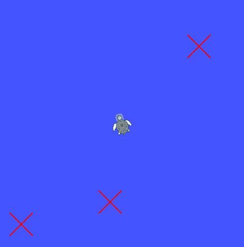

**Homework 1: Turtle Control Package**

 Anna Garverick 

This package draws given waypoints, then waits for a service call with a start position to send the turtle to each waypoint.

To run this package, launch the launchfile run_waypoints.launch, then call the /restart service and input the starting coordinates.

    roslaunch turtle_control run_waypoints.launch

    rosservice call /restart "start_x: <float> start_y: <float>

The waypoints can be editted in the waypoint.yaml file. The turtle will follow the waypoints in the order they are written in the list.  

Alternatively, after running the launch file, the translate node may be killed to instead send velocity commands from a rosbag recording file. It would be neccessary to first call the TeleportAbsolute service to send the turtle to the starting position in this case. 

Full video: 
https://youtu.be/vlPdNbGtckgk